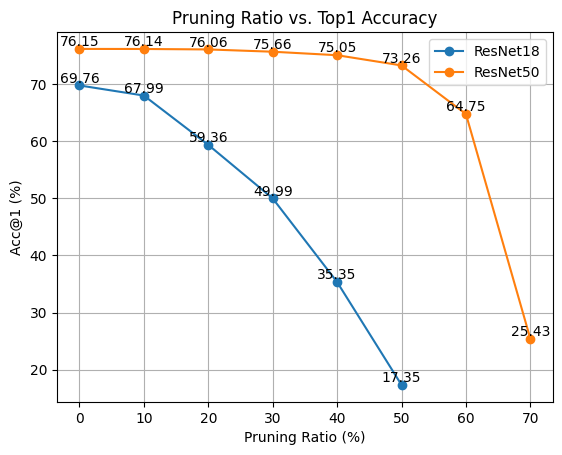

# Network Pruning
We implentment `weight pruning` (unstrctured pruning) in two senerios:

-   global pruning (forward + backward)
-   gredient pruning (only backward)

> `Channel pruning` is not considered (also named strctured pruning, neuron pruning, connection pruning) and the implementation is in [/.old](.old/) (not maintained, not recommended, just FYI).
<div align=left>

</div>


## Unofficial Implementation of [DWP](https://arxiv.org/abs/2208.08677)
This repo only contains the code for network pruning. For the attack code, there are a lot of open-source framework you can use, and the only modification is to apply the pruning methods on the surrogate model. Line 198-203 in [test.py](test.py) shows how to use the pruning functions.

```python
from global_pruning import global_prune
model = global_prune(model, p_prune = args.p_prune, p_bern = args.p_bern)

from gredient_pruning import gredient_prune
model = gredient_prune(model, p_prune = args.p_prune, p_bern = args.p_bern)
```


## Implemention Details
### 3 steps in weight pruning

-   collect all weights (solo tensor element, one value).
-   sort all weights (in ascending order) by absolute value.
-   set the smallest top-k weights to zero.

### Global pruning

modify the `module.weight` directly and the original weight is saved in `module.weight_orig`, which can be restored by `module.weight = nn.Parameter(module.weight_orig.clone())`.

### Gradient pruning

`with torch.autograd.graph.saved_tensors_hooks(self.pack, self.unpack)` is used to register the hooks on `nn.Conv2d` to modify the unpacked inputs (weights) during unpacking process from computing graph in gradient computation.

## Hyperparameters

- `p_prune`: pruning ratio, the percentage of weights to be pruning candidates.
- `p_bern`: bernoulli ratio, the percentage of candidates to be pruned.
- pruning ratio = p_prune \* p_bern, where p_bern usually is 1.


## ImageNet Test Results

Test script:

```bash
python test.py \
    --data /path/to/imagenet/ \
    --prune_type global \
    --p_prune 0.1 \
    --p_bern 1.0
```

### Global pruning (forward + backward)

`p_bern` set to default 1.0, which means all pruning candidates are pruned.

| network   | p_prune   | pruning ratio | acc@1     |
| --------- | --------- | ------------- | --------- |
| resnet18  | 0         | 0%            | 69.76%    |
| resnet18  | 0.1       | 10%           | 67.99%    |
| resnet18  | 0.2       | 20%           | 59.36%    |
| resnet18  | 0.3       | 30%           | 49.99%    |
| resnet18  | 0.4       | 40%           | 35.35%    |
| resnet18  | 0.5       | 50%           | 17.35%    |
| --------- | --------- | ---------     | --------- |
| resnet50  | 0         | 0%            | 76.15%    |
| resnet50  | 0.1       | 10%           | 76.14%    |
| resnet50  | 0.2       | 20%           | 76.06%    |
| resnet50  | 0.3       | 30%           | 75.66%    |
| resnet50  | 0.4       | 40%           | 75.05%    |
| resnet50  | 0.5       | 50%           | 73.26%    |
| resnet50  | 0.6       | 60%           | 64.75%    |
| resnet50  | 0.7       | 70%           | 25.43%    |

Large model (resnet50) is more robust to pruning, containing more redundant weights.

### Gradient pruning (only backward)

same result as no pruning since the forward pass is not pruned. It may be useful in sparse (dynamic) backpropagation in training.

## Reference

https://pytorch.org/tutorials/intermediate/pruning_tutorial.html#remove-pruning-re-parametrization

Wang, Hung-Jui, Yu-Yu Wu, and Shang-Tse Chen. "Enhancing Targeted Attack Transferability via Diversified Weight Pruning." arXiv preprint arXiv:2208.08677 (2022).

Han, Song, et al. "Learning both weights and connections for efficient neural network." Advances in neural information processing systems 28 (2015).
